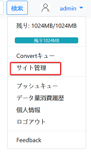
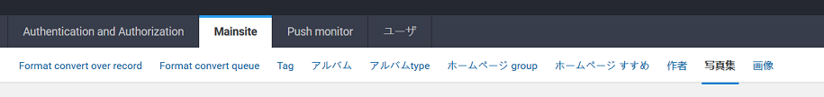

KindleGalleryPusher📷
==========

[demoはこちら](http://gallery.lpanda.net/)

貴方の写真集をみんなとシェアしませんか？

- [KindleGalleryPusher📷](#kindlegallerypusher)
- [1. このサイトアプリのユーザは？](#1-このサイトアプリのユーザは)
- [2. このサイトアプリについて](#2-このサイトアプリについて)
  - [2.1. requirements](#21-requirements)
  - [2.2. thanks for](#22-thanks-for)
  - [2.3. データベースに関して](#23-データベースに関して)
    - [2.3.1. mysqlに関して](#231-mysqlに関して)
    - [2.3.2. sqlite に関して](#232-sqlite-に関して)
  - [2.4. kindle送信に関して](#24-kindle送信に関して)
  - [2.5. hostnameに関して](#25-hostnameに関して)
  - [2.6. ユーザデータ容量に関して](#26-ユーザデータ容量に関して)
  - [2.7. nginx + uwsgi でサービス提供](#27-nginx--uwsgi-でサービス提供)
- [3. サイト管理](#3-サイト管理)
- [4. 今後の予定](#4-今後の予定)


# 1. このサイトアプリのユーザは？
* 自分の写真集をkindleでもみたい人
* kindleを使っている友達にシェアしたい人


# 2. このサイトアプリについて
* アプロードされた写真集を自動に*mobi* *epub* フォーマットに変換できます
* 気に入った写真集を直接にkindleデバイスに送信できます

## 2.1. requirements
> * python 3.7
> * Django>2.1
> * awesome-slugify
> * mysqlclient
> * python-cv2
> * Pillow
> * psutil
> * requests
> * beautifulsoup4
> * lxml
> * [django suit-v2 ](https://django-suit.readthedocs.io/en/v2/)
> * django-clean 

## 2.2. thanks for 
> * [KCC](https://github.com/ciromattia/kcc)
 
## 2.3. データベースに関して
 
1.  データベースは*mysql*を使います。*KindleGalleryPusher/settings.py* のこの部分を編集してください
    ```python
    DATABASES = {
        'default': {
            'ENGINE': 'django.db.backends.mysql',
            'NAME': 'kindleGallerysite',
            'USER': 'your_mysql_username',
            'PASSWORD': 'your_mysql_password',
            'HOST': '127.0.0.1',
        }
    }
    ```
2. 次に *mysql shell* でデータベースを作ります
    ```sql
    CREATE DATABASE kindleGallerysite
    ```
3. 次に下のように、データベースを初期化させます
    ```bash
    python manage.py makemigrations account
    python manage.py makemigrations mainsite
    python manage.py makemigrations pushmonitor
    python manage.py migrate
    ```   
4. 最後に下のコマンドでサイトを実行してみます
    ```bash
    python manage.py runserver 127.0.0.1:8000
    ```     
    実行した後、*127.0.0.1:8000*から、サイトを見れます
    
    **警告！**
    
    **python manage.py runserver　はあくまでテスト、および *debug* のため、*django* に内蔵された簡単なweb serverです！本番でサービスを提供したいなら、*nginx + uwsgi* でサービスを提供してください！(簡単の説明は下の *nginx + uwsgi* 部分を参考してください)** 
### 2.3.1. mysqlに関して

現在mysqlの最新バージョンは*8.0*です。*mysql 8.0*から、新しいパスワード暗号化方法が導入されました。

しかし、現在の*django*はこの新しい暗号化方式を支援していませんので、もし*mysql 8.0*以上のバージョンを使うなら、暗号化方式を*Legacy Authentication Method*に変更してください

### 2.3.2. sqlite に関して

もしsqliteを使いたいなら、*KindleGalleryPusher/settings.py* の*DATABASES*を下のように変更したください

``` python
    DATABASES = {
        'default': {
        'ENGINE': 'django.db.backends.sqlite3',
        'NAME': 'datas.sql',
        }
    }
```

## 2.4. kindle送信に関して

詳しいkindleの送信機能説明はアマゾンのページをご覧ください。

[Kindleパーソナル・ドキュメントサービス](https://www.amazon.co.jp/gp/help/customer/display.html/ref=kinw_myk_pd_ln?ie=UTF8&nodeId=200767340#assignemail)

簡単に言うと、Kindleの送信機能はつまり
> 送信したいファイルを添付ファイルとして、eメールの形でkindleデバイスと連携しているメールボックスに送信する。
> 
> 送信後、kindleデバイスは自動に添付ファイルをダウンロードする

送信機能を有効にするため、*KindleGalleryPusher/settings.py* のsmtpを設定してください
```python
EMAIL_HOST = 'smtp.yourserver.net'
EMAIL_HOST_USER = 'your email'
EMAIL_HOST_PASSWORD = 'your_smtp_password'
```

また、*pushmonitor/mailsender.py*　も同じく設定してください

```python
smtp_username = 'your email'
smtp_password = 'your_smtp_password'
smtp_hostname = 'smtp.yourserver.net'
```

## 2.5. hostnameに関して

*KindleGalleryPusher/settings.py*の*ALLOWED_HOSTS* 部分で、自分のdomainを入れてください

```python
ALLOWED_HOSTS = ['gallery.lpanda.net', 'localhost', '127.0.0.1']
```

## 2.6. ユーザデータ容量に関して

不正な大量ダウンロードでサーバを高負荷状態にさせることを防ぐため、データ容量制度を導入しました。（携帯のデータ容量と同じ感じ）

* アカウントのデフォルトデータ容量は *1GB* です
* 毎回ファイルをダウンロードする時、データ容量が削られます
* データ容量が0になったら、ダウンロードすることが不可能になります
* また、ユーザの全部のダウンロード履歴も記録されます
* 毎月、データ容量は *1GB* に回復します

もし *1GB*　のデータ容量を調整したいなら、 *account/models.py* の *USER_BASE_BANDWIDTH*　を調整したください


## 2.7. nginx + uwsgi でサービス提供
1. まずは*nginx*をインストールします。*debian* 系なら
    ```
    apt-get install nginx
    ```
    でインストールできます
2. 次に*uwsgi*をインストールします
    ```
    pip install uwsgi
    ```
3.　次に*uwsgi* のプロファイルを作成します。作成例はファイル *uwsgi_linux_demon.ini* にあります。

```ini
[uwsgi]
socket = 127.0.0.1:8001
chdir = /root/KindleGalleryPusher/
wsgi-file = KindleGalleryPusher/wsgi.py
processes = 4
threads = 2
stats = 127.0.0.1:8002
daemonize = /root/KindleGalleryPusher/log_uwsgi.log
pidfile = /root/KindleGalleryPusher/uwsgi.pid
```
    
4. 最後にコマンド *uwsgi uwsgi_linux_demon.ini* でウェイブサービスを実行します
5. *nging* プロファイルの方はファイル *nginx_sample.cof*　を参考してください。各*alias*の部分を正しいパスに修正してください。また、*server_name* も自分のdomainに設定してください。
    ```nginx
    upstream django {
        # server unix:///path/to/your/mysite/mysite.sock; # for a file socket
        server 127.0.0.1:3031; # for a web port socket (we'll use this first)
    }

    # configuration of the server
    server {
        # the port your site will be served on
        listen      9000;
        # the domain name it will serve for
        server_name 127.0.0.1; # substitute your machine's IP address or FQDN
        charset     utf-8;

        # max upload size
        client_max_body_size 1000M;   # adjust to taste

        # Django media
        location /media/img  {
            alias /mnt/e/project/KindleGalleryPusher/media/img;  # your Django project's media files - amend as required
        }

        location /static {
            alias /mnt/e/project/KindleGalleryPusher/static; # your Django project's static files - amend as required
        }

        # Finally, send all non-media requests to the Django server.
        location / {
            uwsgi_pass  django;
            include      /etc/nginx/uwsgi_params; # the uwsgi_params file you installed
        }
    location /donwloadbook {
        internal;
        alias /mnt/e/project/KindleGalleryPusher/media;
    }

    }
    ```


# 3. サイト管理
1. まずはサイトの管理アカウントを作成します
    ```bash
    python manage.py createsuperuser
    ```
2. 管理アカウントを作成した後、サイトのホームページから、アカウントをログインします
3. 下のようにサイト管理のリンクがでます
   
   
4. 管理ページから、サイトを管理することができます
   


# 4. 今後の予定

現在一番大きいな問題はフォマード変換キューと送信キューは mysql で作られています。
普通なら、キューは *redis* でキューを作るのが一番よいと考えられます。
これからはキューを *redis* で作ります。